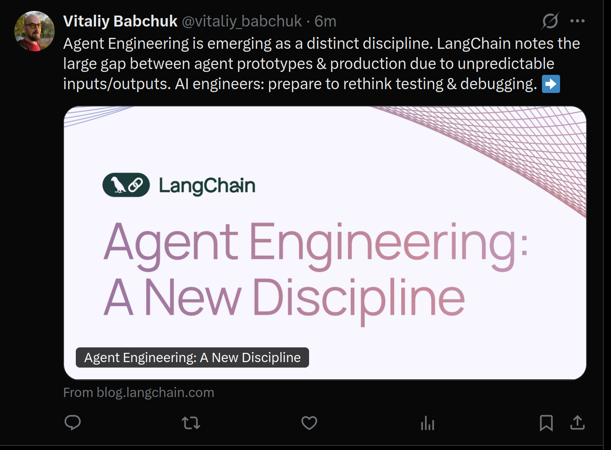
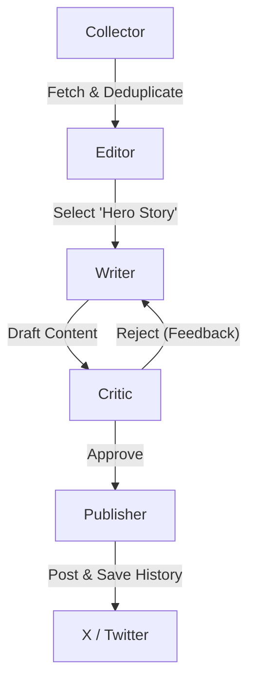

# Autonomous Social Media Agents 🤖


An autonomous multi-agent system designed to curate, write, critique, and publish high-quality technical content to X (Twitter). Built with **Clean Architecture**, powered by **Google Gemma 3 (27B)** via local inference, and orchestrated by **LangGraph**.

### 📸 Live Demo
The system autonomously selects the most important news ("Hero Story"), writes a draft, self-corrects based on critique, and publishes using native Twitter cards.


*(Example of autonomous posts generated by the system)*

---

## 🏗 Architecture

The system follows a **Hexagonal Architecture** (Ports & Adapters) approach, isolating the core business logic (Agents) from infrastructure (vLLM, Twitter API, RSS Feeds).

### The Agent Workflow (LangGraph)
The cognitive process is modeled as a directed cyclic graph with a "Human-in-the-loop" pattern (simulated by the Critic).



1.  **Collector Agent:** Scrapes RSS feeds (OpenAI, DeepMind, Anthropic), checks local history to **prevent duplicates**, and filters for fresh content.
2.  **Editor Agent (The Brain):** Analyzes all fetched articles and selects the **single most impactful story** (The "Hero Story") based on technical significance, filtering out marketing fluff.
3.  **Writer Agent (Gemma 3):** Writes a viral, concise tweet focused solely on the selected story. Uses **Multimodal capabilities** to understand attached images.
4.  **Critic Agent:** Acts as a Senior Editor. Enforces strict constraints (e.g., <280 chars) and checks for factual accuracy. If the draft fails, it sends specific feedback back to the Writer.
5.  **Publisher Agent:** Handles the integration with X API v2, performs smart text truncation (safety net), and updates the local history database.

---

## 🚀 Key Features

*   **Native Multimodality:** Uses Gemma 3 Vision to "see" images in news articles and use them for context.
*   **Self-Correction Loop:** The Writer doesn't just generate text; it improves it iteratively based on the Critic's feedback.
*   **Deduplication & History:** Maintains a persistent JSON history (via Docker volumes) to ensure the same news is never posted twice.
*   **Smart Truncation:** Automatically formats tweets to fit platform limits without cutting words halfway.
*   **Resilience:** Handles broken links, empty feeds, and API errors gracefully without crashing the daemon.

---

## 🛠 Installation & Setup

### Prerequisites
*   Docker & NVIDIA Container Toolkit (for vLLM).
*   X (Twitter) Developer Account (Free Tier or Basic).
*   ~60GB VRAM (for Gemma 3 27B) or modify config for smaller models.

### 1. Clone & Configure
```bash
git clone https://github.com/your-username/autonomous-content-agents.git
cd autonomous-content-agents

# Create environment variables
cp .env.example .env
# Edit .env with your HF_TOKEN and X API Keys.
```

### 2. Run with Docker Compose (Recommended)
This command starts the vLLM inference server and the Agent application in Daemon mode.

```bash
# Build and start services
docker compose up -d --build

# View logs to watch the agents think
docker compose logs -f agent
```

*The agent runs in a loop (default: every hour). Data is persisted in `./data`.*

---

## 🧪 Development & Testing

For local development without Dockerizing the agent logic:

```bash
# Install dependencies with uv
uv sync

# Run unit tests
uv run pytest tests/unit

# Run integration tests (requires vLLM running)
uv run pytest tests/integration

# Run the agent manually once
uv run python -m src.content_agents.main
```

---

## 📂 Project Structure

```text
src/
├── content_agents/
│   ├── agents/          # Agent Logic
│   │   ├── collector.py # RSS Fetching & Deduplication
│   │   ├── editor.py    # News Selection (Router)
│   │   ├── writer.py    # Content Generation
│   │   ├── critic.py    # Quality Assurance
│   │   └── publisher.py # API Interface
│   ├── core/            # Config, Logger, LLM Factory
│   ├── graph/           # LangGraph Workflow & State
│   ├── services/        # Adapters (Twitter, History, RSS)
│   └── main.py          # Entry Point
```

## 📜 License
MIT
