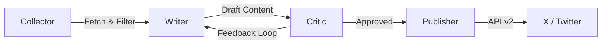

# Autonomous Social Media Agents 🤖


An autonomous multi-agent system designed to curate, write, critique, and publish high-quality technical content to X (Twitter). Built with **Clean Architecture**, powered by **Google Gemma 3 (27B)** via local inference, and orchestrated by **LangGraph**.

---

## 🏗 Architecture

The system follows a **Hexagonal Architecture** (Ports & Adapters) approach, isolating the core business logic (Agents) from infrastructure (vLLM, Twitter API, RSS Feeds).

### The Agent Workflow (LangGraph)
The cognitive process is modeled as a state machine:



1.  **Collector Agent:** Scrapes RSS feeds from top AI labs (OpenAI, DeepMind, Anthropic), filters by relevance, and performs multimodal analysis (extracts images).
2.  **Writer Agent (Gemma 3):** Analyzes the context (text + images) and generates engaging, fact-based tweets. Supports "Chain of Thought" reasoning.
3.  **Critic Agent:** Acts as a Senior Editor. Reviews the draft for factual accuracy, style, and formatting. Rejects low-quality drafts, forcing the Writer to iterate.
4.  **Publisher Agent:** Handles the integration with X API v2 to post the final content.

---

## 🚀 Tech Stack

*   **Core:** Python 3.12, LangGraph, LangChain.
*   **Inference:** `vLLM` running locally (Dockerized) on NVIDIA A100.
*   **Model:** `google/gemma-3-27b-it` (Multimodal, 128k context).
*   **Infrastructure:** Docker Compose, Pydantic (Strict Typing), Structlog (JSON Logging).
*   **Tooling:** `uv` (Package Manager), `ruff` (Linting), `pytest` (Testing).

---

## 🛠 Installation & Setup

### Prerequisites
*   Docker & NVIDIA Container Toolkit (for vLLM).
*   Python 3.12+ (managed by `uv`).
*   X (Twitter) Developer Account (Free Tier or Basic).

### 1. Clone & Configure
```bash
git clone https://github.com/your-username/autonomous-content-agents.git
cd autonomous-content-agents

# Create environment variables
cp .env.example .env
# Edit .env and add your HF_TOKEN (for Gemma 3) and X API Keys.
```

### 2. Start Infrastructure (vLLM)
We run the LLM inference server in a dedicated container.
```bash
docker compose up -d vllm
# Wait for "Application startup complete" (downloads ~50GB weights)
docker compose logs -f vllm
```

### 3. Run the Agents
```bash
# Install dependencies
uv sync

# Run in Daemon mode (checks for news every hour)
uv run python src/content_agents/main.py --loop --interval 3600
```

---

## 🧪 Testing

The project includes a comprehensive test suite (Unit & Integration).

```bash
# Run unit tests (logic, schemas)
uv run pytest tests/unit

# Run integration tests (requires vLLM and Internet)
uv run pytest tests/integration
```

---

## 📂 Project Structure

```text
src/
├── content_agents/
│   ├── agents/          # Agent Logic (Collector, Writer, Critic)
│   ├── core/            # Config, Logger, LLM Factory
│   ├── graph/           # LangGraph Workflow & State
│   ├── schemas/         # Pydantic Data Contracts
│   ├── services/        # Adapters (Twitter Client, RSS Fetcher)
│   └── main.py          # Entry Point
```

## 📜 License
MIT