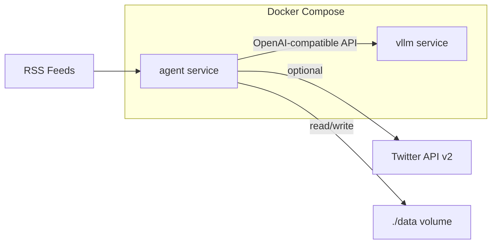

# Autonomous Content Agents


A LangGraph-based multi-agent workflow for content generation with local LLM inference. The repository demonstrates agent orchestration, cyclic critique loops, typed shared state, and Docker-based deployment — using RSS ingestion and a Twitter publisher adapter as a concrete end-to-end example.

---

## Engineering Problem

Building reliable agentic systems requires more than chaining LLM calls. This project addresses:

- **Orchestration** — coordinating specialized agents with explicit control flow and conditional routing
- **Shared state** — passing structured data between nodes with typed reducers
- **Iterative refinement** — a Writer–Critic cycle that improves output before publication
- **Local inference** — running models on owned infrastructure via vLLM
- **Reproducible deployment** — Docker Compose with persistent data volumes

The reference domain is AI/tech news curation and short-form content publishing. Publishing is implemented as one interchangeable service integration (Twitter/X); the workflow itself is platform-agnostic.

---

## Why LangGraph

Traditional linear chains cannot express feedback loops. LangGraph provides:

- **Native cycles** — the Writer–Critic loop is a first-class graph edge, not a workaround
- **Explicit state schema** — `AgentState` defines exactly what flows between nodes
- **Conditional routing** — router functions decide the next node based on state

See [ADR 001](docs/adr/001-use-langgraph.md) for the full decision record.

---

## Workflow Architecture

The cognitive process is modeled as a directed cyclic graph with five nodes and two conditional routers.

> **Auto-generated graph:** [`docs/assets/workflow.mmd`](docs/assets/workflow.mmd) — regenerate with `uv run aca-visualize`. For the engineering workflow (replay, inspection, publisher switching), see [docs/ENGINEERING.md](docs/ENGINEERING.md).

**Routers:**

- `check_news_availability` — after Collector, retries with another rubric or terminates when all rubrics are exhausted (`termination_reason: no_news`)
- `should_publish` — after Critic, routes to Writer (rewrite), Publisher (approved), or END (`termination_reason: max_iterations`)

### Agent Responsibilities

| Node | LLM | Temperature | Responsibility |
|------|-----|-------------|----------------|
| **Collector** | No | — | Selects a weighted-random rubric, fetches RSS articles (24h window), deduplicates against URL history |
| **Editor** | Yes | 0.1 | Selects one article by index from titles; fallback to first article on parse error |
| **Writer** | Yes | 0.7 | Drafts short-form content; optionally includes article image in the LLM prompt |
| **Critic** | Yes | 0.0 | Hard length gate (280 chars) + LLM semantic review; approves or returns feedback |
| **Publisher** | No | — | Truncates if needed, posts via publisher adapter, records URL in history |

`MAX_ITERATIONS = 3` caps **rewrites after the initial draft** (`iteration_count`). The workflow may run up to **four Writer → Critic passes** (one initial draft plus three rewrites). After the rewrite cap, the run ends without publishing.

---

## Deployment Architecture


```mermaid
graph LR
    subgraph dockerCompose [Docker Compose]
        agent[agent service]
        vllm[vllm service]
    end
    rss[RSS Feeds] --> agent
    agent -->|OpenAI-compatible API| vllm
    agent -->|optional| twitter[Twitter API v2]
    agent -->|read/write| data["./data volume"]
```

Two services:

1. **`vllm`** — serves the LLM (default: `google/gemma-3-27b-it`) via OpenAI-compatible API on port 8000
2. **`agent`** — runs the LangGraph workflow in a daemon loop (default: every 3600 seconds)

The `./data` volume persists `sources.json` (feed configuration) and `history.json` (processed URLs).

**Hardware:** the default 27B model requires approximately 60GB VRAM. Smaller models can be configured via `MODEL_NAME` in `.env`.

---

## Repository Structure

```text
src/
├── content_agents/
│   ├── agents/          # Node logic (Collector, Editor, Writer, Critic, Publisher)
│   ├── core/            # Config, logger, LLM factory
│   ├── graph/           # LangGraph workflow, state, routing
│   ├── schemas/         # Domain types (NewsArticle, TweetDraft, Critique)
│   ├── engineering/     # Visualization, replay, snapshot utilities
│   ├── services/        # External integrations (RSS, publishers, history)
│   └── main.py          # Entry point (single run or daemon loop)
docs/
├── ARCHITECTURE.md      # Detailed architecture documentation
├── ENGINEERING.md       # Developer workflow (replay, visualize, inspect)
└── adr/                 # Architecture Decision Records
snapshots/               # Replay input snapshots
examples/outputs/        # Sample publisher output (markdown adapter)
```

---

## Quality Guarantees

CI ([`.github/workflows/ci.yml`](.github/workflows/ci.yml)) runs on every push and pull request:

- `ruff check` and `ruff format --check`
- `mypy src tests`
- `pytest` (unit tests only)

Integration tests (vLLM, GPU, network, Twitter) are excluded from CI and must be run manually:

```bash
uv run pytest -m integration
```

---

## Current Limitations

These are intentional scope boundaries for v0.1, not oversights:

| Area | Limitation |
|------|------------|
| **Publishing** | Twitter/X (default), console, and markdown adapters; Twitter text-only; mock publish when credentials are absent |
| **Persistence** | No LangGraph checkpointing; workflow state is ephemeral per run; only processed URLs persist in `history.json` |
| **Human oversight** | Fully automated; no approval gates, interrupts, or human-in-the-loop |
| **Multimodal** | Optional image in Writer LLM prompt only; Editor and Critic are text-only; Publisher does not attach media |
| **Content selection** | Editor evaluates article titles, not full body text |
| **Iteration bound** | `MAX_ITERATIONS = 3` rewrites after the initial draft (up to four Writer → Critic passes); run ends without publish if not approved |
| **Quality assurance** | LLM-based semantic review only; no retrieval, citations, or external fact-checking |
| **Operations** | Hourly polling daemon; no job scheduler, rate-limit management, or observability stack |
| **CI scope** | Unit tests only; full stack not exercised in CI |

---

## Installation & Setup

### Prerequisites

- Docker and NVIDIA Container Toolkit (for vLLM)
- HuggingFace token (for gated models)
- X (Twitter) Developer credentials (optional — mock publish without them)
- ~60GB VRAM for the default 27B model

### 1. Clone & Configure

```bash
git clone https://github.com/pueraeternis/autonomous-content-agents.git
cd autonomous-content-agents

cp .env.example .env
# Edit .env: HF_TOKEN, and optionally Twitter API keys.
```

### 2. Run with Docker Compose

```bash
docker compose up -d --build
docker compose logs -f agent
```

The agent runs in a loop (default: every hour). Data persists in `./data`.

---

## Development & Testing

```bash
# Install dependencies
uv sync

# Verify repository health (matches CI)
uv run ruff check .
uv run ruff format --check .
uv run mypy src tests
uv run pytest

# Run integration tests manually (requires vLLM and/or internet)
uv run pytest -m integration

# Run the workflow once
uv run python -m content_agents.main

# Engineering demo (no Twitter, RSS network, or vLLM required)
uv run python -m content_agents.main \
  --replay snapshots/ai_breakthrough.json \
  --publisher console \
  --inspect
```

See [docs/ENGINEERING.md](docs/ENGINEERING.md) for the full engineering workflow.

---

## Documentation

- [Architecture](docs/ARCHITECTURE.md) — workflow graph, state model, design trade-offs
- [Engineering](docs/ENGINEERING.md) — replay, visualization, inspection, publisher adapters
- [ADR 001: LangGraph](docs/adr/001-use-langgraph.md) — orchestration framework choice
- [ADR 002: vLLM](docs/adr/002-local-inference-vllm.md) — local inference decision

---

## License

MIT — see [LICENSE](LICENSE).
