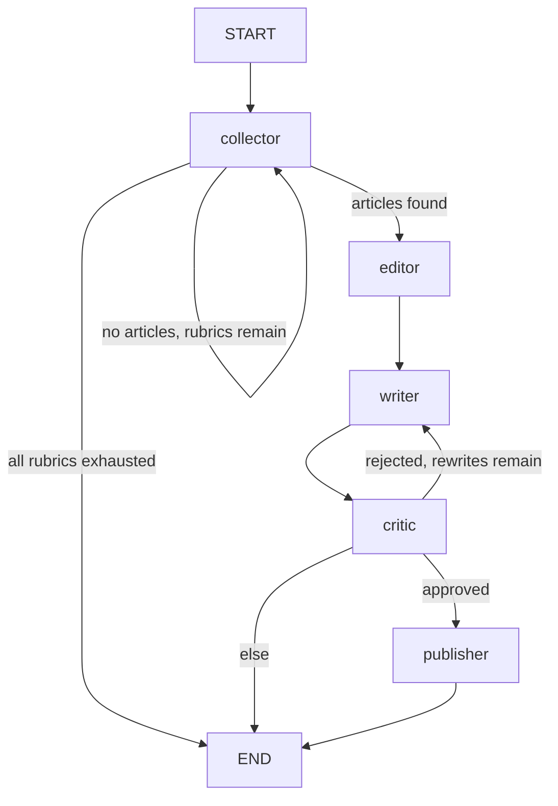
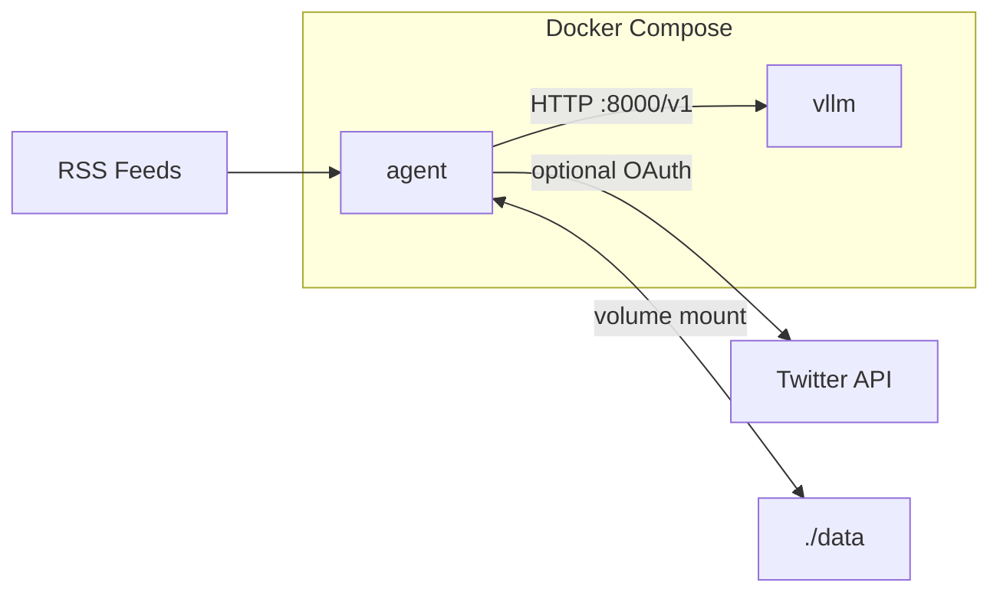

# System Architecture

## Overview

Autonomous Content Agents is a reference implementation of a LangGraph-based multi-agent workflow. Five specialized nodes collaborate through a shared typed state to ingest news, select a story, draft content, iteratively refine it via an automated critique loop, and publish through an external service integration.

The system runs as a scheduled daemon (hourly by default) inside Docker Compose, with local LLM inference via vLLM.

---

## Architectural Style

The codebase follows a **layered monolith** structure:

| Layer | Location | Responsibility |
|-------|----------|----------------|
| Orchestration | `graph/` | LangGraph `StateGraph`, routing functions, state definition |
| Node logic | `agents/` | Per-node functions that read and mutate `AgentState` |
| Domain types | `schemas/` | Pydantic models (`NewsArticle`, `TweetDraft`, `Critique`) |
| External integrations | `services/` | RSS fetching, Twitter client, URL history |
| Infrastructure | `core/` | Configuration, structured logging, LLM factory |

Agents import concrete service singletons directly. There are no abstract ports or dependency-injection containers. This keeps the codebase simple for a v0.1 reference implementation while leaving a clear seam for future adapter extraction.

---

## Workflow Graph

The workflow is a `StateGraph` compiled without a checkpointer — each `app.invoke()` starts with fresh state and runs to completion.

### Nodes

| Node | Function | External I/O |
|------|----------|--------------|
| `collector` | `collector_node` | `news_service`, `history_service` |
| `editor` | `editor_node` | LLM (temperature 0.1) |
| `writer` | `writer_node` | LLM (temperature 0.7), optional image download |
| `critic` | `critic_node` | LLM (temperature 0.0) |
| `publisher` | `publisher_node` | `twitter_service`, `history_service` |

### Conditional Routers

**`check_news_availability`** (after Collector):

- Articles found → `editor`
- No articles, more rubrics to try → `collector` (retries with a different rubric)
- All rubrics exhausted (`topic == "None"`) → `END` with `termination_reason: no_news`

**`should_publish`** (after Critic):

- Empty `critique_history` → `END`
- Last critique approved and draft exists → `publisher`
- Rejected, draft exists, `iteration_count < MAX_ITERATIONS` (3) → `writer`
- Otherwise → `END` with `termination_reason: max_iterations`

**Rewrite cap:** `MAX_ITERATIONS = 3` limits Writer rewrites after the initial draft (`iteration_count`). The graph may execute up to four Writer → Critic passes (one initial draft plus three rewrites) before terminating with `max_iterations`.

### Termination Reasons

| Reason | Meaning |
|--------|---------|
| `no_news` | All rubrics exhausted with no fresh articles |
| `writer_failed` | Writer could not produce a draft |
| `max_iterations` | Critic rejected draft after the rewrite cap (3 rewrites; up to four Writer → Critic passes) |
| `published` | Live tweet posted successfully |
| `mock_published` | Mock publish completed (no Twitter credentials) |
| `publish_failed` | Publisher encountered an error |

---

## State Model

`AgentState` is a `TypedDict` passed between all nodes. Fields with `Annotated[list, operator.add]` use LangGraph reducers to append rather than replace.

| Field | Type | Reducer | Purpose |
|-------|------|---------|---------|
| `tried_rubrics` | `list[str]` | append | Rubrics attempted in this session |
| `topic` | `str` | replace | Current rubric name |
| `articles` | `list[NewsArticle]` | replace | Fetched candidates |
| `selected_article` | `NewsArticle \| None` | replace | Editor's pick |
| `draft` | `TweetDraft \| None` | replace | Current content draft |
| `critique_history` | `list[Critique]` | append | All critiques in this run |
| `iteration_count` | `int` | replace | Writer rewrites after the initial draft (0–3; capped by `MAX_ITERATIONS`) |
| `final_tweet_id` | `str \| None` | replace | Twitter ID if live publish |
| `termination_reason` | `str \| None` | replace | Why the run ended |
| `publish_mode` | `"live" \| "mock" \| None` | replace | Publish outcome |

State is **ephemeral** — it exists only for the duration of a single `app.invoke()` call. There is no LangGraph checkpointing or crash recovery.

---

## Agent Responsibilities

### Collector

- Loads rubric definitions from `data/sources.json`
- Selects a rubric via weighted random, skipping already-tried rubrics
- Fetches articles from all feeds in the rubric (24-hour window)
- Filters URLs present in `history.json`
- Resets `selected_article` and `draft` on each fetch

### Editor

- Receives article titles (not full body text)
- LLM selects one article by index with reasoning
- Fallback: first article on parse error or invalid index

### Writer

- Builds a prompt from the selected article (markdown content + optional base64 image)
- On rewrite loops, incorporates Critic feedback (special handling for length violations)
- Outputs a `TweetDraft` via Pydantic parser
- Sets `draft.media_files` if an image was attached to the prompt

### Critic

- **Hard gate:** rejects if `len(draft.content) > 280` characters (Python check, not LLM)
- **LLM review:** evaluates length compliance, factuality, and value/usefulness against article text
- Approval threshold: LLM sets `is_approved` (prompt targets scores 8–10)
- Sets `termination_reason: max_iterations` when rejected at the iteration cap

### Publisher

- `_smart_truncate()` as a safety net if draft still exceeds platform limit
- Calls `twitter_service.post_tweet(text, media_urls)`
- On success (live or mock): records article URL in `history.json`
- Returns `final_tweet_id`, `publish_mode`, `termination_reason`

---

## External Services

### RSS Ingestion (`NewsFetcherService`)

- Reads feed configuration from `data/sources.json` (cached)
- Parses RSS via `feedparser` and HTML via BeautifulSoup
- Extracts images from `media_content`, enclosures, or `` tags
- Filters articles to a 24-hour window

### LLM Inference (`get_llm`)

- Factory returns `ChatOpenAI` pointed at vLLM's OpenAI-compatible endpoint
- Default model: `google/gemma-3-27b-it`
- Per-agent temperatures: Editor 0.1, Writer 0.7, Critic 0.0
- Output parsing via `PydanticOutputParser` (expects JSON in LLM response)

### Publisher Adapter (`TwitterClient`)

- OAuth 1.0a authentication via tweepy
- **Live mode:** `create_tweet(text=...)` — text only; media upload is skipped
- **Mock mode:** when credentials are absent, returns success without posting (still records URL in history)
- Sole publisher implementation; designed as a replaceable service integration

### URL History (`HistoryManager`)

- Persists processed URLs to `data/history.json` as `{"urls": [...]}`
- Loaded on init, saved on `add()`
- Only deduplication persistence — not workflow state

---

## Deployment Model

- **Configuration:** Pydantic Settings loaded from `.env` (LLM endpoint, model name, Twitter credentials, log level)
- **Logging:** structlog with console format (development) or JSON (production)
- **Daemon:** `main.py` runs `app.invoke()` in a `while True` loop with configurable interval (default 3600s)
- **Error handling:** per-iteration exception catch in daemon mode; `GraphRecursionError` caught separately

---

## Design Trade-offs

### Cycles over chains

The Writer–Critic loop is the core engineering pattern. LangGraph makes this a native graph edge rather than a manual retry loop. The rewrite cap (`MAX_ITERATIONS = 3`) prevents infinite loops at the cost of occasionally ending without publish; the workflow may still run up to four Writer → Critic passes before terminating.

### Local inference over SaaS APIs

vLLM on owned GPU infrastructure provides privacy, predictable cost, and throughput for high-volume runs. The trade-off is hardware requirements (~60GB VRAM for 27B) and container maintenance. See [ADR 002](adr/002-local-inference-vllm.md).

### Mock publish over hard failure

When Twitter credentials are absent, the Publisher returns a successful mock result and still records the URL. This allows development and testing without API access while preserving deduplication behavior.

### No checkpointing

The graph compiles without a checkpointer. Workflow state is ephemeral per run. Only processed URLs persist. This simplifies the v0.1 implementation; durable execution is a known future extension.

### Direct service imports over ports/adapters

Agents import concrete singletons (`twitter_service`, `news_service`, `history_service`). This reduces boilerplate for a reference implementation. Extracting protocols behind interfaces is straightforward if additional publishers or data sources are added.

---

## Intentional Limitations

| Area | Limitation |
|------|------------|
| **Publishing** | Twitter/X text-only; media upload skipped; mock publish without credentials; no other platforms |
| **Persistence** | No LangGraph checkpointing; workflow state ephemeral; only URLs in `history.json` |
| **Human oversight** | Fully automated; no approval gates or interrupts |
| **Multimodal** | Optional image in Writer prompt only; Editor, Critic, and Publisher are text-only |
| **Content selection** | Editor uses article titles, not full body |
| **Iteration bound** | `MAX_ITERATIONS = 3` rewrites after the initial draft (up to four Writer → Critic passes) |
| **Quality assurance** | LLM semantic review only; no external fact-checking |
| **Operations** | Polling daemon; no scheduler, rate limits, or observability stack |
| **CI** | Unit tests only; integration/GPU/Twitter excluded |

---

## Related Documentation

- [ADR 001: LangGraph](adr/001-use-langgraph.md)
- [ADR 002: vLLM](adr/002-local-inference-vllm.md)
- [README](../README.md)
